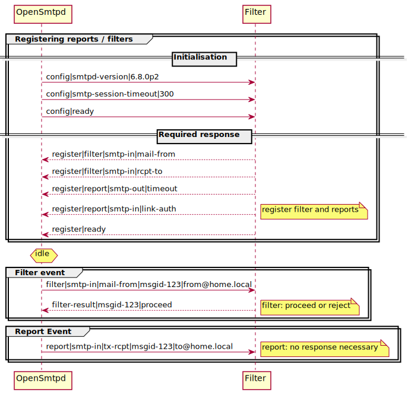

# Howto use filters / reports in OpenSmtpd
Since release 6.4.0 OpenSmtpd has support for external filters.<br/>
It takes some time to understand its concept.<br/>
Here is a small showcase about it.

## Quickstart
1. Install [OpenSMTPD](https://www.opensmtpd.org/)
2. Create a simple smtpd.conf
```
filter afilter proc-exec "/usr/bin/python3 /tmp/afilter/afilter.py"
listen on eth0 port smtp filter { afilter } 
action "inbound" mbox
action "outbound" relay filter {afilter}
match from any for local action "inbound"
match from local for any action "outbound"
```
3. Copy afilter.py and afilter_utils.py to the right location.
4. Start smtpd: `smtpd -f smtpd.conf -d`
5. Test your SMTP server: `swaks -f from@home.local -t to@home.local -s localhost -ehlo home.local`
6. Watch your output:
- <span style="color:purple">Request: OpenSmtpd -> Filter color is purple</span>
- <span style="color:green">Response: OpenSmtpd <- Filter color is <span style="color:green">green</span>
6See results complete log in /tmp/opensmtpd_afilter.log

## How does it work?



See also: [./sample_log.txt](./sample_log.txt)


## Further ideas
1. Implement abstract methods like FilterSmtpIn->mail_from(ctx, address)
```
class ReportSmtpIn(IReportSmtpIn):
    @staticmethod
    def link_connect(ctx, rdns, fcrdns, src, dest):
        # your implementation
        pass
```
2. Listen only for special reports / filters
```
hooks = [
    ReportSmtpIn.link_connect, ...
]
```

3. Clear state in tx-reset() or link-disconnect() method of ReportSmtpIn.
